# Low Poly Factory
## Intro 
Low Poly Factory(LPF) is a procedural content generation tool in a form of Blender add-on, specialized in lowpoly landscapes.

The idea is to easily generate the scene and then tweak parameters/materials and do manual work to make end result original. Each object that LPF generates is unique, but still based on parameters the user specifies.

LPF is a perfect tool to assist you in productive low-poly modeling, usable for renders, animations or game-ready models. There is an option to bake materials to vertex colors, which makes it easy to import models to your 3D game engine of choice. Low-poly models are also suitable for virtual/augmented reality development.

## Showcase
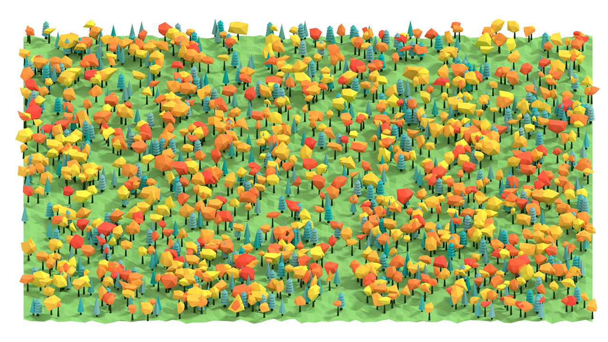
Check out renders from LPS development here:
http://lowpolyfactory.tumblr.com

## Download
Add-on download will be available shortly!

## Guide
### Instalation
Select 'File'->'User Preferences...'->'Add-ons', hit 'Install from File...' and locate downloaded 'add_mesh_LowPolyFactory.zip' file. Check the mark to enable add-on. If you wish to run add-on every time you boot up Blender, hit 'Save User Settings'.

### Quick Start
Let's start by showing a quickest way of generating a simple landscape:
- Boot up empty Blender scene
- Hit space and type 'Add Terrain'
- While keeping terrain selected, hit space and type 'Populate'
- Hit space again and type 'Set Lights'
- If you are in perspective mode, press 'View'->'View Persp/Ortho' to switch to orho view
- Press Shift+Z to render in viewport
- TA-DA! You will be presented with scene similar to this.

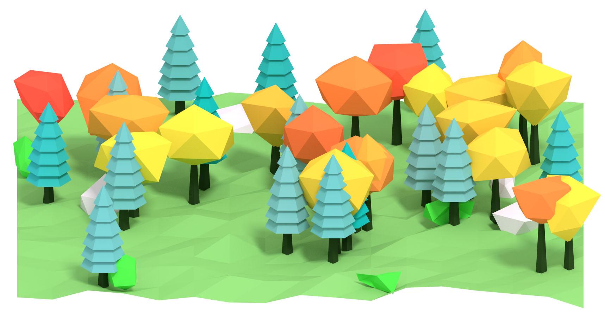

If you got interested, follow the guide to learn more!

### Trees
A special focus is placed on trees, usually the most crucial part of scene. There are several types available, with separate trunk and top generation.

#### Oak

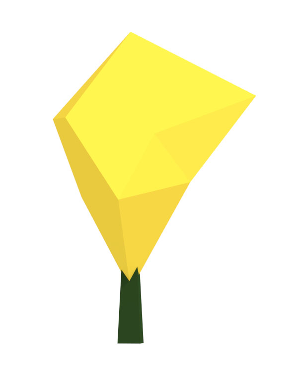

Select 'Add'->'Mesh'->'Low Poly'->'Low Poly'->'Tree' or hit space and type 'Add Tree'. Hit T to open Tool Shelf so  we can adjust tree properties. Select 'Oak' tree type.

To edit trunk, select 'Trunk' settings from Tool Shelf. You can specify segmnets(resolution), length and diameters of trunk.

Note that you must provide minimum and maximum values for each parameter. When object is generated, random value is selected from the min-max range. This makes it easy to create hundreds of objects, each with varied look.

To edit tree top, select 'Top' settings from Tool Shelf. Specify subdivisions(resolution), scale and displace modifier parameters. You can experiment with these values to see what you can generate.

Finally, you can check 'Keep Modifiers' if you want to edit them further from Blender modifiers tab. Otherwise, the modifiers are applied to mesh.

#### Pine

Generate tree object as described in Oak section, but select 'Pine' tree type this time. Trunk parameters are shared with Oak, tree top is Pine specific.

You can adjust number of stages and base stage size. To control the shrinking of next stages, adjust 'shrink size' and 'shrink multiplier'. 'Stage step' value let's you modify space between individual stages. 'Stage segments' controls the resolution of stage. 'Rotate stages' let's you randomly rotate each stage.

#### Palm

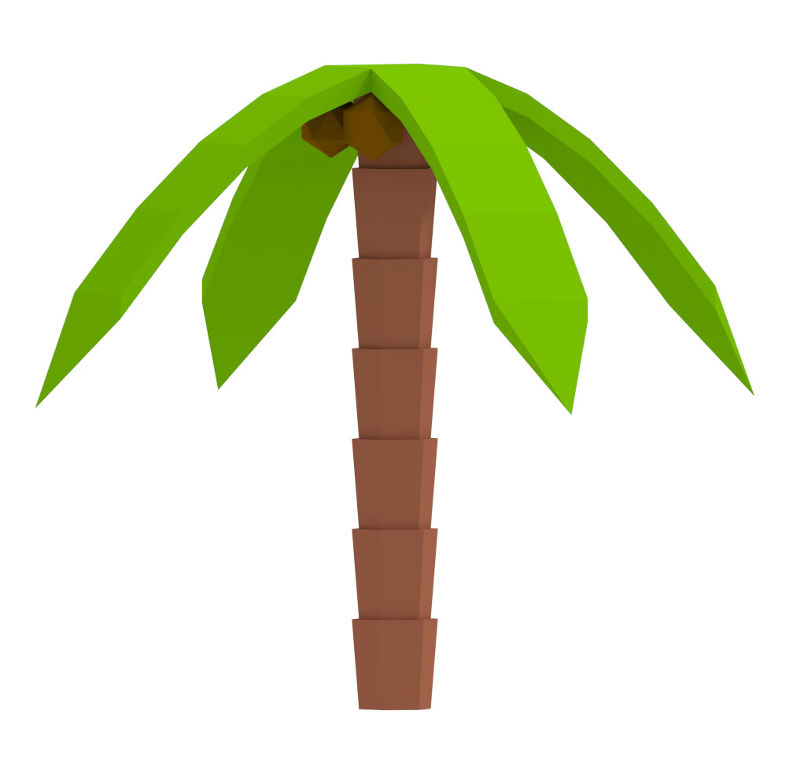

Generate tree object as described in Oak section, and select 'Palm' tree type. Both trunk and top parameters are Palm specific.

To create a nice looking palm trunk, stages are used. Adjust number of stages, segments(resolution), stage length and stage diameters to generate varied trunks.

Switch to 'Top' tree settings. Edit number of leaves, leaf length and size(width). Most importantly, don't forget to specify number of coconuts!

### Bushes

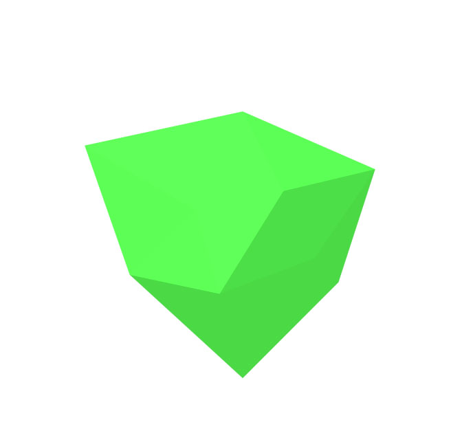

Select 'Add'->'Mesh'->'Low Poly'->'Bush'. Bushes are the little blob things with no trunks(use tree type if you need them). They are used to add small details to the scene. Set subdivisons(resolution) and scale on each axis. You can also edit displace modifier settings.

### Rocks

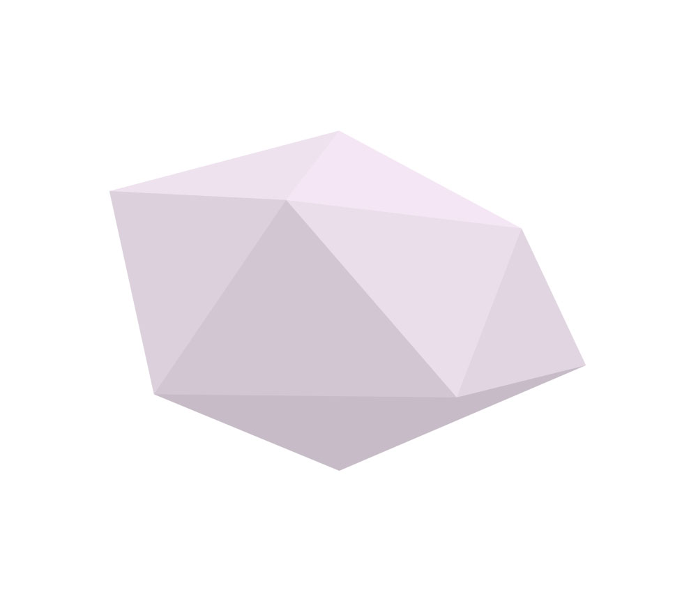

Select 'Add'->'Mesh'->'Low Poly'->'Rock'. Similar to bushes, subdivisions(resolution), scale on each axis and displace modifier can be set to generate varied types of rocks.

### Terrain

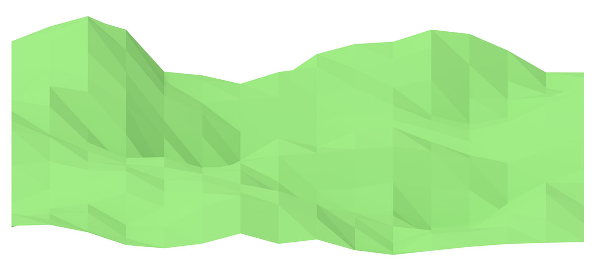

Finally, we need a place to plant all this objects on. Select 'Add'->'Mesh'->'Low Poly'->'Terrain'. Choose 'Plane' type for classic landscape, or 'Sphere' for planets. Select size and segments/subdivisions of terrain. 'Clouds' and 'Voronoi' displace methods are built in. Use displace strength to affect height of hills and displace scale to affect size of hills.

To learn how to create different terrain biomes, see material tweaking section.

#### Water

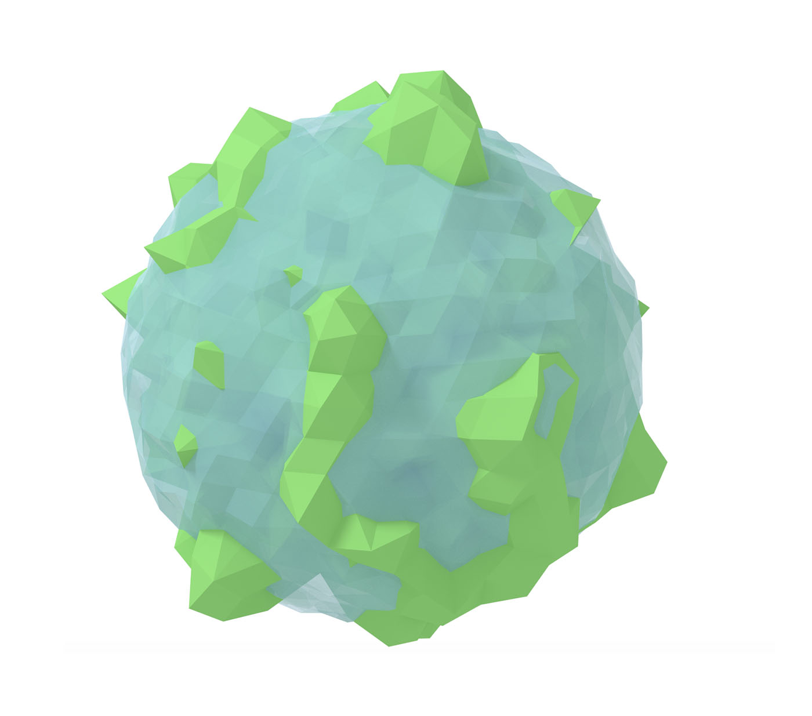

Select 'Add'->'Mesh'->'Low Poly'->'Water' to add water to terrain. Set type to 'Plane' or 'Sphere'. Enable displace to add waves or keep it off for still water.

#### Grass

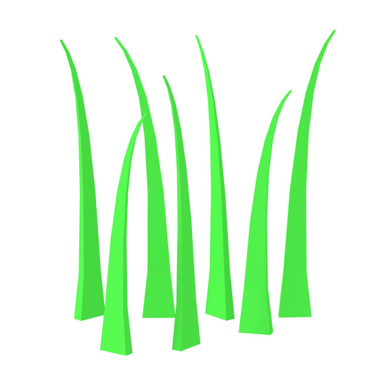

Select 'Add'->'Mesh'->'Low Poly'->'Grass'. The grass is generated blade by blade, to ensure uniqueness of each object. If you need to place lots of blades, use populate feature described below or Blender particle systems.

For each blade, specify scale, length, grow scale and grow direction.

### Clouds

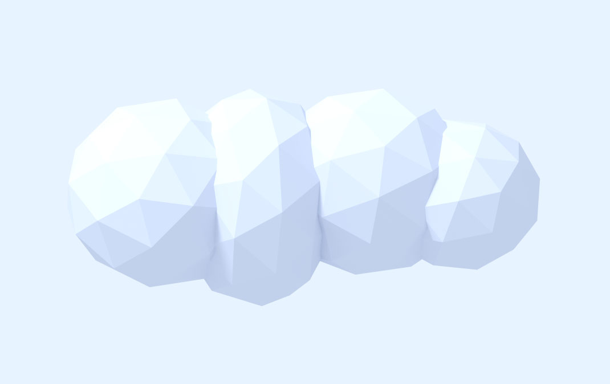

Select 'Add'->'Mesh'->'Low Poly'->'Cloud'. Set number of speheres to use and subdivisions(resolution) and scale of each sphere.

### Populate

Populate feature allows to quickly generate large number of object instances. On the picture above, terrain is populated with 2500 trees, 250 bushes and 250 rocks. Objects are distributed on the terrain and planted at correct terrain heigh, thus making it possible to populate hilly or spherical terrains.

Locate 'LowPoly Factory' section in Render Panel, type amount of objects to be spawned, select object which you want to populate(usually terrain) and hit 'Populate'.

Populate feature uses the same parameters that are specified when creating objects manually. Select 'Merge' option to group all created instances into one Blender object.

Note: Based on your computer performance and number of objects being spawned, this can take a lot of time(up to several minutes).

### Tweaking materials

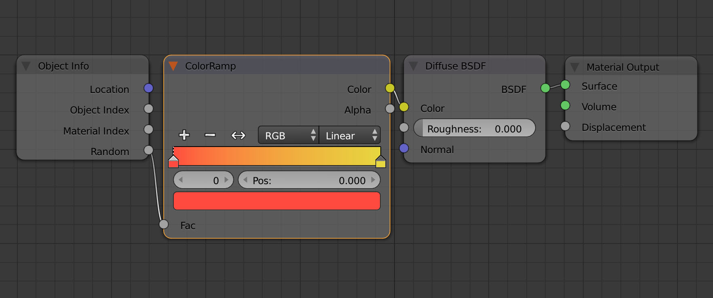

Node based cycles materials are used. Select object you want to edit and switch to node editor. By default, materials use simple color ramp, which slightly randomizes color for each material user. You can simply adjust the color ramp values or use a different material. Materials are shared for each object type.

### Light setup

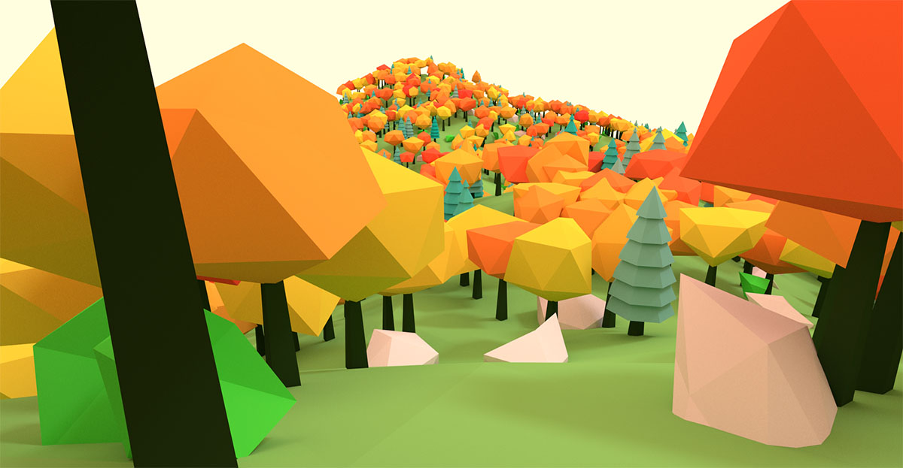

LPF comes with a nifty little tool to quickly set-up simple lighting in a scene. Locate 'LowPoly Factory' section in Render Panel, select desired light type(dawn, midday, dusk, night) and hit 'Set Lights'.

### Author

A lot of effort was put into making this add-on, in a hope that you will enjoy using it! You can check out what I have been up to here: [@luboslenco](https://twitter.com/luboslenco)
